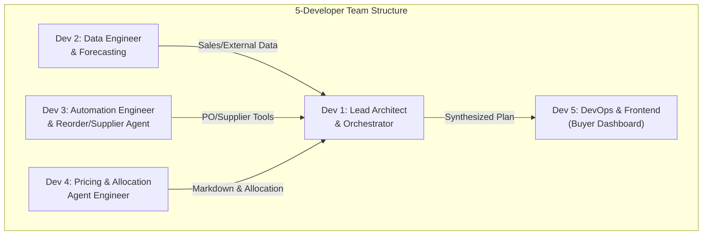

# Team Implementation Plan: Multi-Agent Inventory & Demand Intelligence

This plan details how your team of 5 can build and launch the **Inventory & Demand Intelligence System** described in your design document. By assigning clear, parallel roles and utilizing GitHub branches, you will build the system efficiently in 6 phases.

---

## 🛠️ The Tech Stack

To build this system using modern multi-agent practices in 2026, you will use:
- **Core Language**: Python 3.10+
- **Agent Framework**: `OpenAI Agents SDK` (as designed in the document) or `LangGraph` / `CrewAI` (if you need visual orchestration).
- **Backend / Orchestration API**: `FastAPI` (for lightweight, high-performance agent triggers and webhook endpoints).
- **Database / Data Warehouse**: `PostgreSQL` (for inventory logs, forecasts, and audits) + `Pinecone` or `pgvector` (for vector embeddings to match similar products).
- **Integration Layer**: `HTTP REST Client` (using `httpx` or `requests`) to connect mock supplier APIs and your inventory simulation.

---

## 👥 Team Roles & Task Allocation (5 Developers)

To ensure everyone is working efficiently without stepping on each other's toes, allocate the roles as follows:

### 🧑‍💻 Developer 1: Lead Architect & Orchestration (Branch: `feature/orchestrator`)
**Role:** Builds the central brain and handles the coordinate flow of specialist agents.
- **Tasks:**
  - Initialize the main Python project structure.
  - Implement the `InventoryOrchestrator` using the **Manager (Orchestrator-as-Tool)** pattern.
  - Define the main coordination loop (`run_inventory_cycle`).
  - Set up **Guardrails & Autonomy Thresholds** (capping automatic spend at $10k, flagging confidence < 0.7, etc.).

### 🧑•💻 Developer 2: Data & Forecasting Agent (Branch: `feature/demand-agent`)
**Role:** Ingests historical data and builds the demand forecasting agent.
- **Tasks:**
  - Create the `DemandForecastingAgent`.
  - Build Mock/Real tools: `get_sales_history` and `get_external_signals` (Weather API, Trends).
  - Define the forecasting logic (either calling GPT-4o with zero-shot prompting or integrating a light stats model like Prophet/ARIMA to work alongside the agent).
  - Output structured JSON: `{sku_id, forecast_7d, forecast_30d, forecast_90d, confidence_score}`.

### 🧑•💻 Developer 3: Automation & Reorder Agent (Branch: `feature/reorder-agent`)
**Role:** Handles supplier communications, automated purchasing, and RFQs.
- **Tasks:**
  - Create the `ReorderSupplierAgent` and `AnomalyDetectionAgent`.
  - Build Mock/Real tools: `get_current_inventory`, `get_supplier_quotes` (to mock different supplier prices), and `create_purchase_order`.
  - Implement the trigger logic (when current stock < safety stock, flag a reorder event).
  - Set up email/message alerting if a supplier capacity or delay is detected.

### 🧑•💻 Developer 4: Allocation & Markdown Agents (Branch: `feature/markdown-allocation`)
**Role:** Optimizes inventory distributions and pricing strategies.
- **Tasks:**
  - Create the `WarehouseAllocationAgent` (optimizes stock levels across multiple fulfillment centers) and `MarkdownPricingAgent` (calculates optimal discounts for slow-moving products).
  - Build Mock/Real tools: `transfer_stock` and `apply_markdown` (updates commerce catalog prices).
  - Impose the safety guardrail: no markdown exceeds 40% depth.

### 🧑•💻 Developer 5: Buyer Dashboard & DevOps (Branch: `feature/buyer-portal`)
**Role:** Builds the visual dashboard for humans to approve critical actions and manages deployment.
- **Tasks:**
  - Build a simple FastAPI dashboard (using HTML/CSS or Streamlit) showing the active inventory status, forecast charts, and **Pending Approvals** (for actions exceeding autonomy thresholds).
  - Build the notification system: integrate Twilio (for WhatsApp alerts) or Slack to ping developers/buyers.
  - Setup the scheduling engine (using a lightweight Python library like `APScheduler` or Cron to run the system every hour).

---

## 📈 Development Roadmap & Milestones

To keep your WhatsApp group free of stress, work in these clear weekly milestones:

| Phase | Milestone | Deliverable | Responsible |
| :--- | :--- | :--- | :--- |
| **Phase 1** | **Data & Mock Setup** (Week 1) | Create the database schemas, seed sales and SKU data, and implement basic WMS/Supplier mock APIs. | Dev 2 & Dev 3 |
| **Phase 2** | **Specialist Agent Dev** (Week 2) | Implement the individual `Demand`, `Reorder`, `Allocation`, and `Markdown` agents on separate branches and test their tools locally. | Dev 2, Dev 3, Dev 4 |
| **Phase 3** | **Orchestration & Rules** (Week 3) | Assemble the specialists under the `InventoryOrchestrator`. Implement the guardrails and test full system simulation. | Dev 1 |
| **Phase 4** | **Human-in-the-Loop Portal** (Week 4) | Connect the FastAPI backend to the dashboard. Setup push alerts (WhatsApp/Slack) for human-approval requests. | Dev 5 |
| **Phase 5** | **Testing & Launch** (Week 5) | Run continuous 24-hour simulation cycles. Measure mape forecast error and liquidate/reorder logs. Merge to `master` and launch! | Whole Team |

---

## 🤝 How to Collaborate (OpenWork, OpenCode & WhatsApp)

1. **Task Management (OpenWork):** We will use **OpenWork** to assign and track our tasks (e.g., assigning Dev 1 to Orchestrator, Dev 2 to Demand Agent, etc.). Every morning, update your progress on OpenWork.
2. **Code Collaboration (OpenCode):** Your teammates will be using **OpenCode** for version control. 
   - Devs create feature branches from `master` (e.g., `git checkout -b feature/demand-agent`).
   - When a feature is finished, push and open a **Merge Request / Pull Request** on OpenCode.
3. **Communication (WhatsApp):** 
   - **Never self-merge.** Drop the OpenCode review link in WhatsApp. At least one teammate must review and approve the code on OpenCode before it merges to `master`.
4. **Shared Mock APIs:** Devs 2, 3, and 4 should agree on the input/output schemas of the mock APIs on Day 1 so they can build their agents independently.

> [!TIP]
> **Start with Mocks:** Don't wait for real databases or external APIs. Create mock Python files (e.g., `mock_wms.py`, `mock_suppliers.py`) returning static JSON payloads. This lets everyone build their agents on Day 1.

> [!IMPORTANT]
> **Secure OpenAI API Keys:** Do not push API keys (`OPENAI_API_KEY`) to GitHub. Use a local `.env` file and load it via `os.getenv()`. Ensure `.env` is listed in your `.gitignore`!
